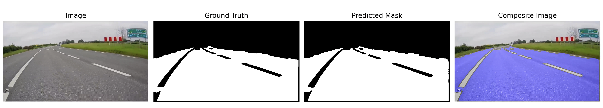

# Road Segmentation using Fully Convolutional Network and VGG16 Transfer Learning
- [Installation](#installation)
- [Directory Structure](#directory)
- [Usage](#usage)
  


## Installation

To run this project these are the packages that needs to be installed. 

```bash
pip install matplotlib==3.7.2
pip install tensorflow-macos==2.13.0
pip install keras-ocr==0.9.3
pip install pillow==10.3.0
```

## Directory Structure
This folder consist of all files used in the program.

### Data Folder

##### Training 
1. Augmented image: Consist of all images that underwent data augmentation.
2. Augmented mask: Consist of masks that paired with the images in augmented image.
3. Images and Masks: Consist of all images and masks from the original dataset.
4. Inpaint: These are the images that have words at the bottom right corner removed.

##### Testing
1. Images: Normal Images
2. Masks: Masks Images

### Model Folder
1. Output_model_15: This is the FCN model that was trained.
2. VGG: This folder consist of the pretrained VGG model used for transfer learning.

## Start Program
To run training, run train_road.py. This program loads the necessary data file (training images and mask) into the program and runs it. 

```bash
# run the training model
python train_seg_road.py
```

To test the program, run test_seg.py. This program loads testing images into the program and outputs the results for the tested images. 

```bash
# run the training model
python test_seg.py
```
